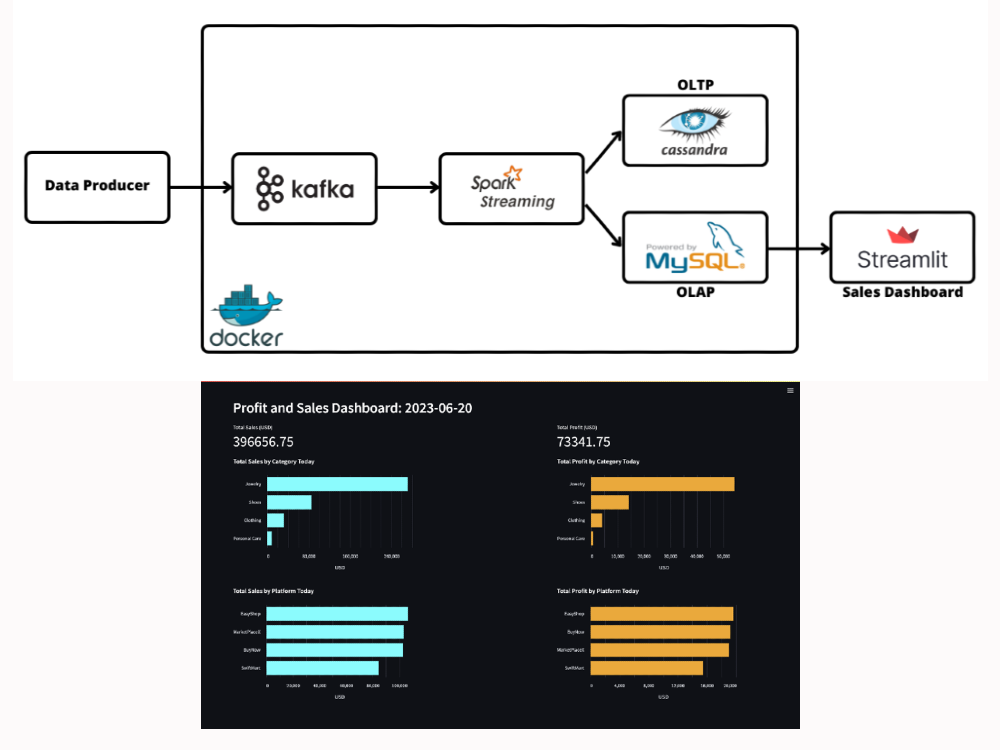

# Building a Streaming Data Pipeline with Open Source Stacks


In this data engineering project, we'll start by producing raw order data. The sample data looks like this:

```json
{'order_id': 1, 'created_at': '2023-06-18 12:33:12', 'platform_id': 1, 'product_id': 5, 'quantity': 7, 'customer_id': 928, 'payment_method': 'paypal'}
{'order_id': 2, 'created_at': '2023-06-18 12:33:13', 'platform_id': 4, 'product_id': 13, 'quantity': 2, 'customer_id': 533, 'payment_method': 'bank transfer'}
{'order_id': 3, 'created_at': '2023-06-18 12:33:14', 'platform_id': 2, 'product_id': 18, 'quantity': 3, 'customer_id': 65, 'payment_method': 'debit card'}
```

Next, we'll stream this data in real-time using Kafka and process it in microbatch fashion using Spark Streaming. Then, we'll load the processed order data into a Cassandra database. Additionally, we'll load the aggregated order data into a MySQL database and perform some analytical operations on the aggregated data. The goal is to generate a (near) real-time dashboard using Streamlit.

You can find a comprehensive guide of this project in the following four articles:
1. [Project Overview And Environment Setup (Part 1)](https://supertype.ai/notes/streaming-data-processing-part-1/)
2. [OLTP And OLAP Databases Setup (Part 2)](https://supertype.ai/notes/streaming-data-processing-part-2/) 
3. [Transactional Data Ingestion And Processing (Part 3)](https://supertype.ai/notes/streaming-data-processing-part-3/) 
4. [Analyzing And Visualizing Data In A Dashboard (Part 4)](https://supertype.ai/notes/streaming-data-processing-part-4/) 


